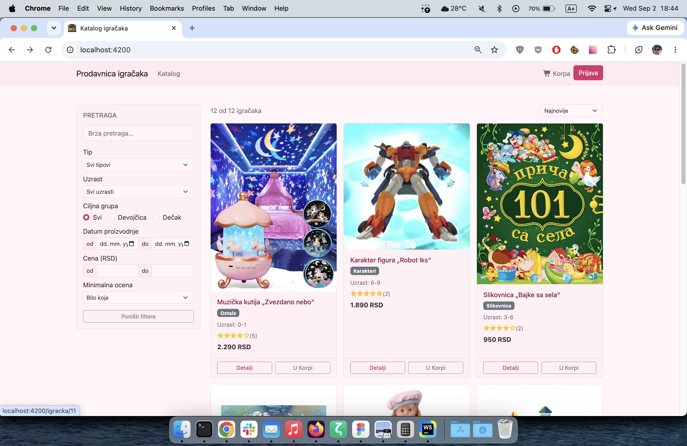
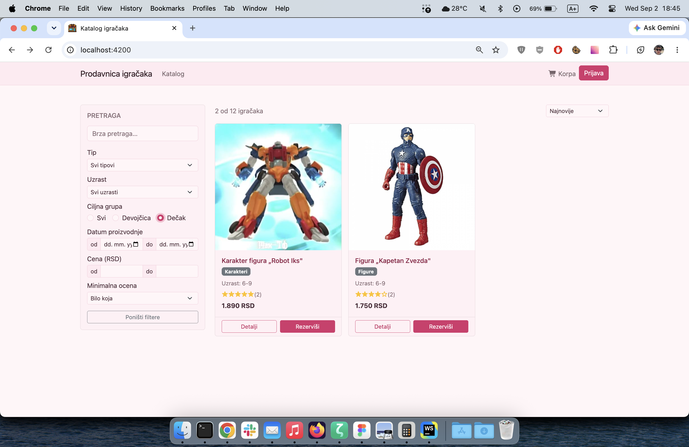
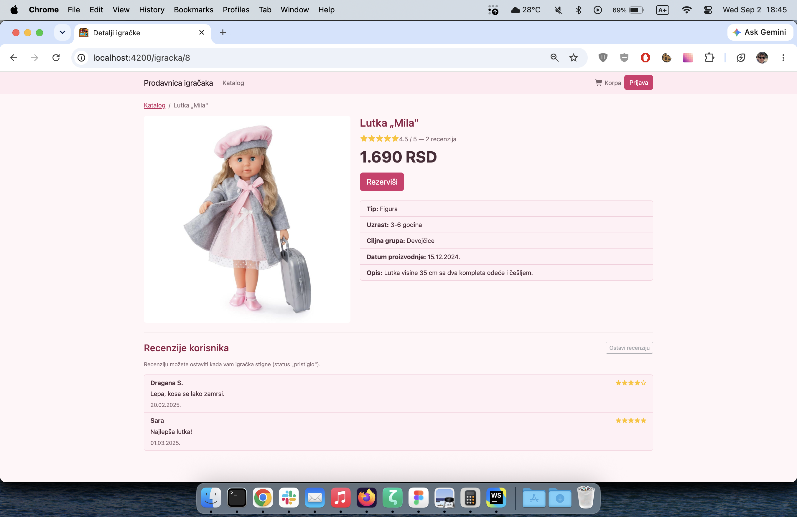
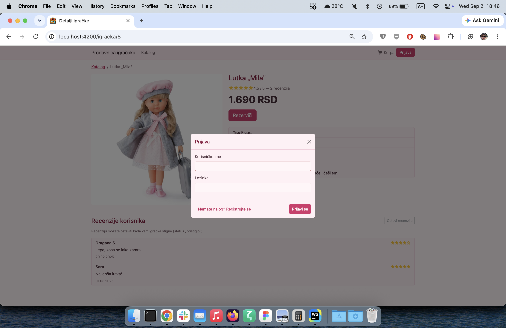
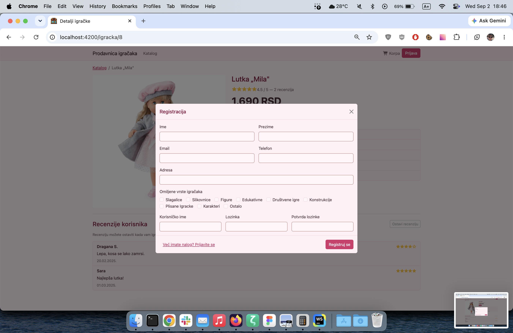
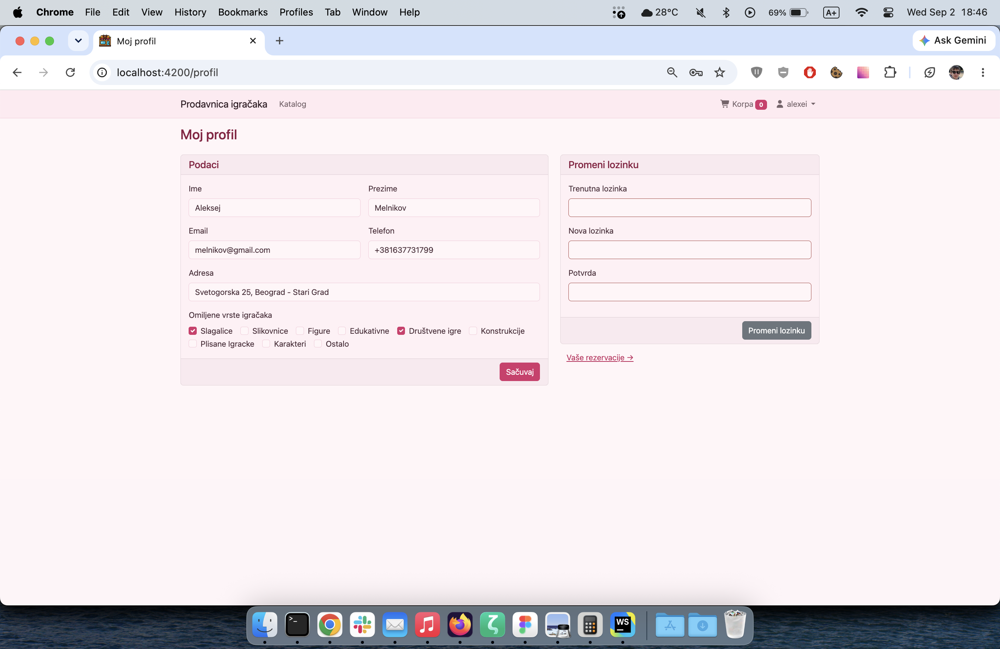
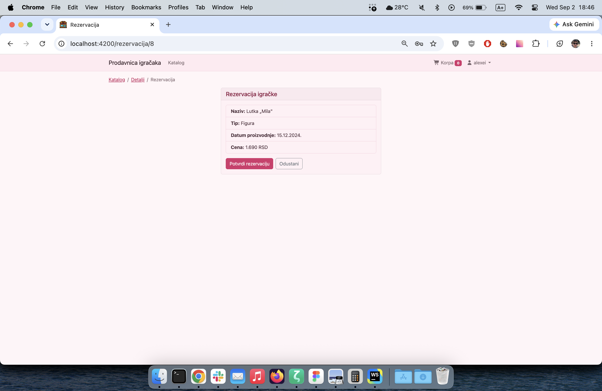
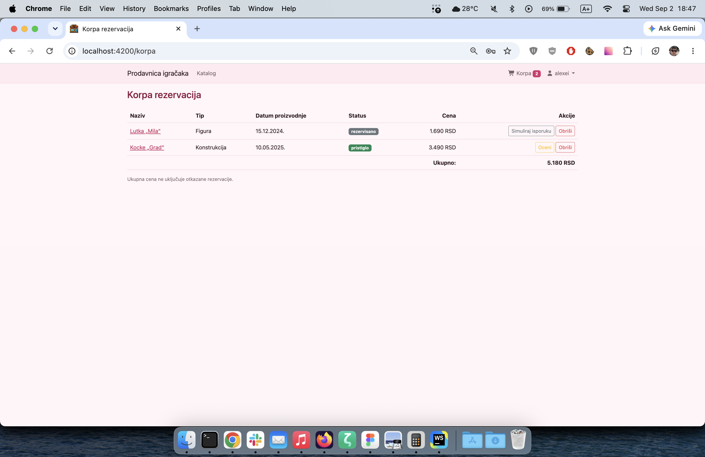
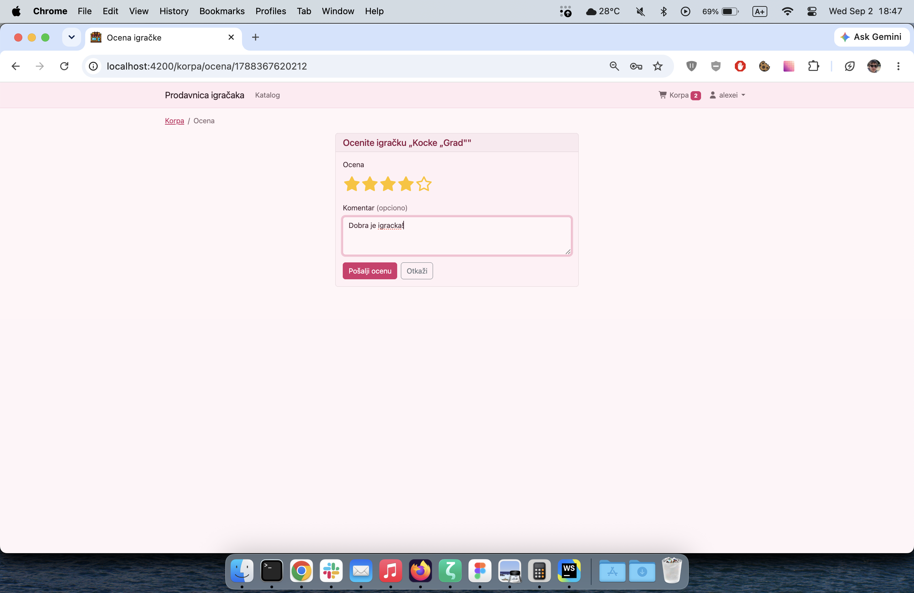

# Opis projekta

Digitalna prodavnica igračaka (Angular 22 + Bootstrap 5.3). Pokretanje: `npm start` → <http://localhost:4200>.

---

## 1. Katalog igračaka (`/`)

**Funkcija: Pretraga igračaka.** Kao kriterijumi pretrage koriste se naziv, tip, uzrast, ciljna grupa, datum proizvodnje, cena i minimalna ocena, uz sortiranje rezultata.

---

## 2. Katalog — primenjeni filteri (`/`)

**Funkcija: Sužavanje ponude po kriterijumima.** Prikazuju se samo igračke koje odgovaraju izabranim kriterijumima (ovde ciljna grupa „Dečak"), uz broj pronađenih igračaka.

---

## 3. Detalji igračke (`/igracka/:id`)

**Funkcija: Prikaz podataka o igrački i recenzija kupaca.** Prikazuju se tip, uzrast, ciljna grupa, datum proizvodnje, opis, cena, prosečna ocena i recenzije; odavde se pokreće rezervacija.

---

## 4. Prijava (modalni dijalog)

**Funkcija: Prijava kupca.** Korisničko ime i lozinka daju pristup rezervaciji, korpi i profilu.

---

## 5. Registracija (modalni dijalog)

**Funkcija: Registracija novog kupca.** Unose se ime, prezime, email, telefon, adresa, omiljene vrste igračaka i pristupni podaci.

---

## 6. Korisnički profil (`/profil`)

**Funkcija: Izmena podataka kupca i lozinke.** Menjaju se lični podaci i omiljene vrste igračaka, a lozinka se menja uz potvrdu trenutne.

---

## 7. Rezervacija igračke (`/rezervacija/:id`)

**Funkcija: Rezervacija igračke.** Potvrdom podataka izabrana igračka se dodaje u korpu u statusu „rezervisano".

---

## 8. Korpa rezervacija (`/korpa`)

**Funkcija: Pregled rezervacija kupca.** Prikazuju se naziv, tip, datum proizvodnje, status i cena svake rezervacije, sa ukupnom cenom i brisanjem stavke.

---

## 9. Korpa — pristigla igračka (`/korpa`)

**Funkcija: Praćenje statusa rezervacije.** Kada igračka pristigne, status se menja na „pristiglo" i otvara se ocenjivanje.

---

## 10. Ocena i recenzija igračke (`/korpa/ocena/:id`)

**Funkcija: Ocena i recenzija igračke.** Za pristiglu igračku kupac daje ocenu od 1 do 5 zvezdica i opcioni komentar, koji se prikazuje na strani detalja.
